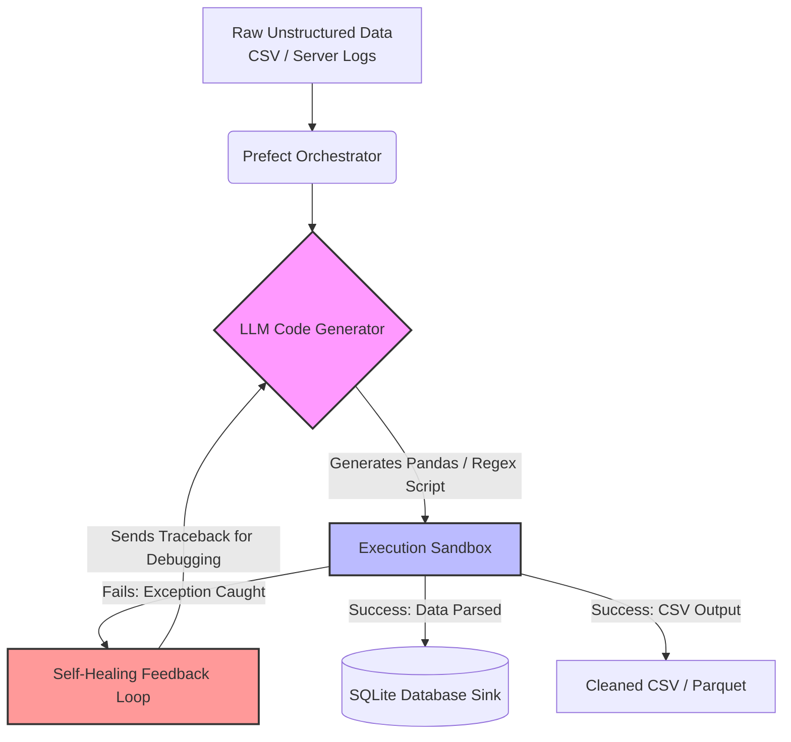

# LLM-powered Data Pipeline 🚀

An automated data engineering pipeline that uses Large Language Models (LLMs) to dynamically generate, execute, and self-heal data cleaning scripts for messy, unstructured datasets.

## 🌟 Highlights for Resume / Interview
* **Data Engineering & ETL**: Designed a modular pipeline to extract messy CSV data, transform it via dynamically generated LLM code, and load it as structured Parquet/CSV files.
* **Multi-source Ingestion**: Capable of processing both dirty E-commerce Sales CSVs and highly unstructured raw Server Logs (Apache/Nginx style).
* **LLM Integration**: Integrated DeepSeek/OpenAI API using `openai` SDK to translate data context (schema, samples) into executable pandas transformations dynamically based on the dataset's specific requirements.
* **Self-healing Mechanism**: Implemented an execution sandbox (`exec`) that captures runtime errors and feeds them back to the LLM for autonomous debugging and code correction, achieving high fault-tolerance.
* **Orchestration**: Orchestrated the workflow using **Prefect**, demonstrating modern DAG-based task scheduling, retry mechanisms, and observability.
* **Database Integration (V2)**: Uses `SQLAlchemy`/`sqlite3` to sink the final structured Pandas DataFrames into a relational SQLite database (`cleaned_data.db`).

## 🏗️ Architecture (System Flow)



## 🚀 Quick Start

1. Install dependencies:
```bash
python -m venv .venv
source .venv/bin/activate  # On Windows use `.\.venv\Scripts\activate`
pip install -r requirements.txt
```

2. Configure your API key in `.env`:
```
OPENAI_API_KEY=sk-your-key-here
OPENAI_BASE_URL=https://api.deepseek.com/v1
```

3. Run the pipeline:
```bash
python pipeline.py
```

## 🛠️ Tech Stack
- **Python**: Core logic
- **Pandas**: Data Manipulation
- **Prefect**: Workflow Orchestration
- **OpenAI API SDK**: LLM communication
